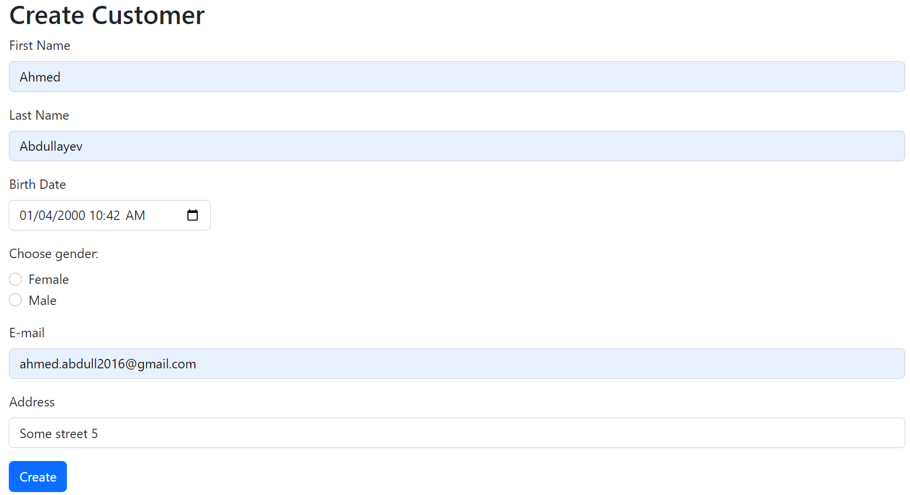
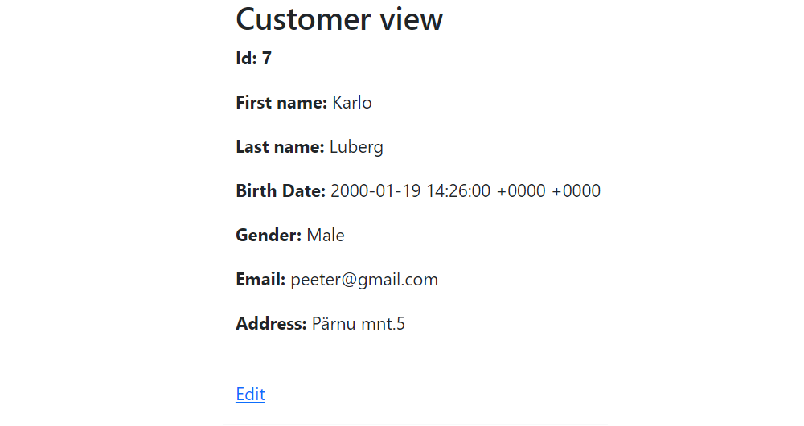

# CRUD application in Golang
- Database: PostgreSQL in Docker
- Unit tests are in customer_test.go file (run "go test")
- Run "docker composer up" to create database and to run migrations
- Service-Repository pattern

## Features
- View and search customers by first and last names with pagination, each column in list is sortable by ASC/DESC order

- Add/edit customer with front/back -end validations(for backend "github.com/go-playground/validator" library)

- View all customer data

### Database

### Routes
	router.HandleFunc("/", controller.Customers).Methods(http.MethodGet)
	router.HandleFunc("/create-customer", controller.CreateView).Methods(http.MethodGet)
	router.HandleFunc("/edit-customer", controller.EditView).Methods(http.MethodGet)
	router.HandleFunc("/show-customer", controller.Show).Methods(http.MethodGet)
	router.HandleFunc("/delete-customer", controller.Delete).Methods(http.MethodGet)

	router.HandleFunc("/create-customer", controller.Post).Methods(http.MethodPost)
	router.HandleFunc("/edit-customer", controller.Update).Methods(http.MethodPost)

### Tech stack
- Golang
- PostgreSQL
- Bootstrap
- Font awesome
- Docker
- Many Golang libraries
- JS/HTML/CSS